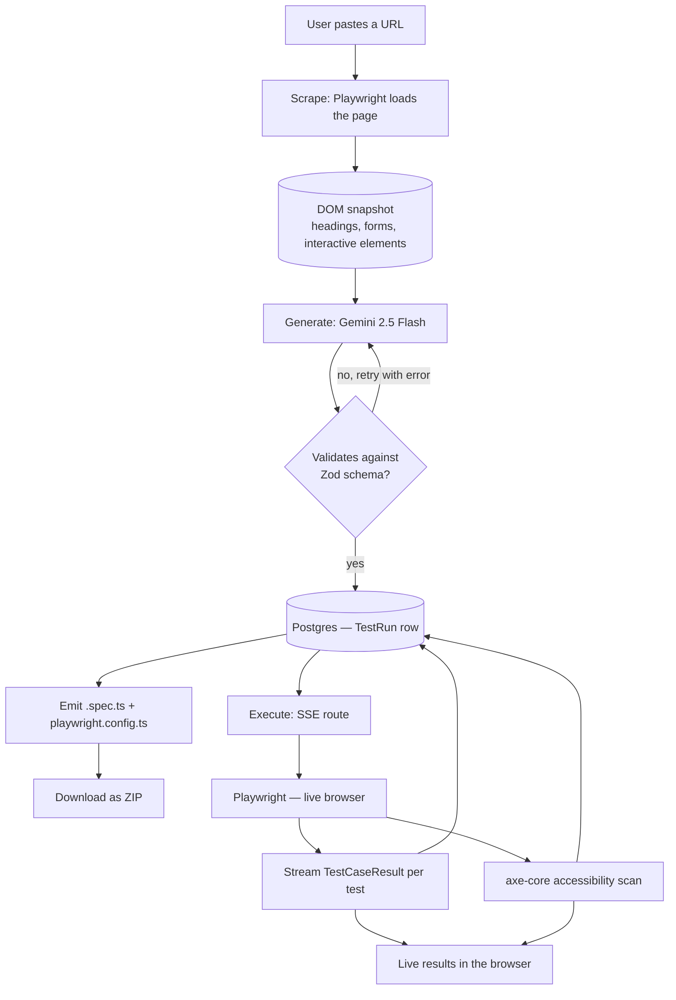

# TestPilot

**Paste a URL. Get a production-ready Playwright test suite — generated, executed live in a real browser, and audited for accessibility, all in under a minute.**

🔗 **Live demo:** https://testpilot-swart.vercel.app
👀 **See it work with zero sign-up:** https://testpilot-swart.vercel.app/sample

---

## What it does

1. **Scrape** — Playwright loads the target page and maps every interactive element, form, and heading into a structured snapshot.
2. **Generate** — Google Gemini turns that snapshot into a test spec: locators, actions, assertions. The output is validated against a strict Zod schema, with automatic retry-with-correction if the LLM's JSON doesn't conform.
3. **Run** — The suite executes live in a real headless browser via Playwright's API directly (no `playwright test` subprocess — this is what makes it work on serverless). Results stream to the browser over Server-Sent Events, test by test, with a screenshot captured either way: proof of the final state on a pass, the failure state on a fail.
4. **Audit** — An axe-core accessibility scan runs against the page, surfacing WCAG 2.1 violations tagged by severity, alongside the functional results.
5. **Ship** — Download the suite as a real `.spec.ts` + `playwright.config.ts` — idiomatic Playwright TypeScript you can read, edit, and drop straight into your own repo.

## Architecture



## Tech stack

| Layer | Choice |
|---|---|
| Framework | Next.js 16 (App Router), TypeScript strict mode |
| Styling | Tailwind CSS v4, shadcn/ui |
| Auth | Clerk |
| Database | Postgres on Neon, Prisma 5 |
| LLM | Google Gemini 2.5 Flash (native JSON mode) |
| Browser automation | `playwright-core` + `@sparticuz/chromium` (serverless-safe) |
| Accessibility | `@axe-core/playwright` |
| Validation | Zod, at every trust boundary (LLM output, API input, env vars) |
| Code highlighting | Shiki (server-rendered, no client JS) |
| Testing | Vitest (unit), throwaway smoke scripts against a real browser (local only) |
| Error tracking | Sentry |
| Deployment | Vercel |

## Local setup

```bash
pnpm install
cp .env.example .env.local   # fill in Clerk, Neon, and Gemini credentials
npx playwright install chromium
# point PLAYWRIGHT_CHROMIUM_EXECUTABLE_PATH in .env.local at the binary that installs
pnpm prisma migrate dev
pnpm dev
```

Open http://localhost:3000.

### Environment variables

See [`.env.example`](.env.example) for the full list. You'll need:
- A [Clerk](https://clerk.com) app (publishable + secret key)
- A [Neon](https://neon.tech) Postgres database (pooled `DATABASE_URL` + direct `DIRECT_URL`)
- A [Gemini API key](https://ai.google.dev/)
- A local Chromium binary path for dev (`npx playwright install chromium` prints where it lands)

### Scripts

| Command | What it does |
|---|---|
| `pnpm dev` | Dev server |
| `pnpm build` | `prisma generate && next build` |
| `pnpm test` | Unit tests (Vitest) |
| `pnpm lint` | ESLint |
| `pnpm tsx scripts/seed-sample-run.ts` | (Re)seeds the public `/sample` run — runs the real scrape + Gemini pipeline and saves the result as `isPublic: true` |
| `pnpm tsx scripts/test-scraper.ts` | Runs the scraper against `localhost:3000` and prints the DOM snapshot — quick sanity check when touching `lib/playwright/scraper.ts` |
| `pnpm tsx scripts/smoke-executor.ts` | Real-browser smoke test of the executor's pass/fail/screenshot paths |
| `pnpm tsx scripts/smoke-a11y.ts` | Real-browser smoke test of the accessibility audit |
| `pnpm tsx scripts/smoke-execute-route.ts` | End-to-end smoke test of the SSE execution route |
| `pnpm tsx scripts/measure-pass-rate.ts` | Runs the seeded sample suite against a real browser and reports pass/fail — used to validate prompt/executor changes |

The smoke scripts all launch a real Chromium instance and are intentionally kept out of CI (slow, and not worth the flakiness on a hosted runner) — they're local verification tools, run by hand when touching `lib/playwright/` or the generation prompt.

## Known limitations

- **Browser-backed features are disabled on the hosted demo.** Scraping and live execution both drive a real Chromium instance, which serverless functions can't reliably host — Vercel's file tracer doesn't ship playwright-core's runtime data files, and the memory and cold-start ceilings are hostile to a browser even when it does. Rather than let a visitor hit a module-resolution stack trace, the deployed app detects this and explains it, while still serving a real, previously-executed run at `/sample` (genuine results, genuine screenshots, genuine axe-core findings). Clone and run locally for the full pipeline. Set `LIVE_EXECUTION_ENABLED=true` to force-enable it on a host that does have a browser runtime.
- **Live execution is capped at 10 test cases per run.** Vercel serverless functions have a hard duration ceiling; running an entire 25-case suite live could exceed it mid-stream. The UI still lists every generated test case — cases beyond the cap show as "not run live" rather than being hidden — and the full suite is always one click away via the ZIP download, which runs locally with no such limit.
- **Locators come from a single DOM snapshot, not a live session.** The generator has never seen the pages behind a click — it can propose a test for an internal navigation, but it can't verify what's on the other side of that link. The prompt is written to only assert what's actually visible in the snapshot for exactly this reason, but a page with meaningfully different content behind hover menus or client-side routing can still trip it up.
- **No self-healing loop yet.** If a generated test fails because of a bad locator, nothing currently re-prompts the LLM with the failure to try again — you'd regenerate the suite. This is a natural next step, deliberately left out of v1 scope to keep the demo path predictable.

## Project structure

```
app/
  api/execute/[runId]/   SSE live-execution route
  api/download/[runId]/  ZIP download route
  api/scrape/, api/generate/   underlying scrape + LLM generation routes
  dashboard/              authenticated app (new run, run history, run detail)
  sample/                 public, no-auth demo run
lib/
  llm/                    Gemini client, system prompt, generation + retry logic
  playwright/             scraper, executor, accessibility audit, shared browser launcher
  generator/               spec JSON -> .spec.ts emitter
  schemas/                 Zod schemas (the trust boundary for LLM output and API input)
scripts/                  seed + smoke-test scripts (local dev only, not part of the app runtime)
```

## License

MIT
